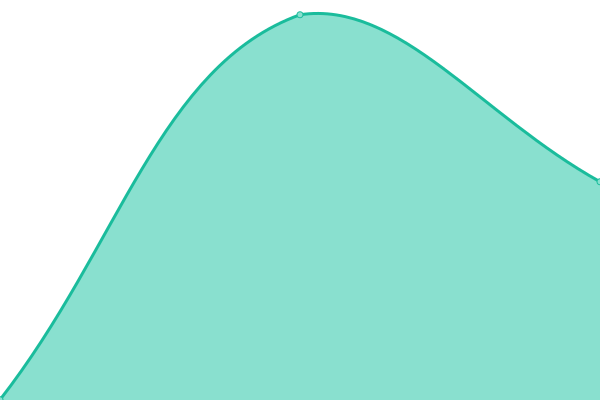

# [📈 Live Status](https://larskristianhaga.github.io/uptime-monitor): <!--live status--> **🟧 Partial outage**

This repository contains the open-source uptime monitor and status page for [Lars Kristian Haga](https://www.linkedin.com/in/larskhaga/), powered by [Upptime](https://github.com/upptime/upptime).

With [Upptime](https://upptime.js.org), you can get your own unlimited and free uptime monitor and status page, powered entirely by a GitHub repository. We use [Issues](https://github.com/larskristianhaga/uptime-monitor/issues) as incident reports, [Actions](https://github.com/larskristianhaga/uptime-monitor/actions) as uptime monitors, and [Pages](https://larskristianhaga.github.io/uptime-monitor) for the status page.

<!--start: status pages-->
<!-- This summary is generated by Upptime (https://github.com/upptime/upptime) -->
<!-- Do not edit this manually, your changes will be overwritten -->
<!-- prettier-ignore -->
| URL | Status | History | Response Time | Uptime |
| --- | ------ | ------- | ------------- | ------ |
|  [http://3fs.no](http://3fs.no) | 🟩 Up | [http-3fs-no.yml](https://github.com/larskristianhaga/uptime-monitor/commits/HEAD/history/http-3fs-no.yml) | 

 1207ms
     
 | 

<a href="https://larskristianhaga.github.io/uptime-monitor/history/http-3fs-no">100.00%</a>
    

|  [https://3fs.no](https://3fs.no) | 🟩 Up | [https-3fs-no.yml](https://github.com/larskristianhaga/uptime-monitor/commits/HEAD/history/https-3fs-no.yml) | 

 76ms
     
 | 

<a href="https://larskristianhaga.github.io/uptime-monitor/history/https-3fs-no">100.00%</a>
    

|  [http://paal-erik.no](http://paal-erik.no) | 🟩 Up | [http-paal-erik-no.yml](https://github.com/larskristianhaga/uptime-monitor/commits/HEAD/history/http-paal-erik-no.yml) | 

 547ms
     
 | 

<a href="https://larskristianhaga.github.io/uptime-monitor/history/http-paal-erik-no">100.00%</a>
    

|  [http://trefellingspesialisten.no](http://trefellingspesialisten.no) | 🟩 Up | [http-trefellingspesialisten-no.yml](https://github.com/larskristianhaga/uptime-monitor/commits/HEAD/history/http-trefellingspesialisten-no.yml) | 

 715ms
     
 | 

<a href="https://larskristianhaga.github.io/uptime-monitor/history/http-trefellingspesialisten-no">100.00%</a>
    

|  [http://trefellings-spesialisten.no](http://trefellings-spesialisten.no) | 🟩 Up | [http-trefellings-spesialisten-no.yml](https://github.com/larskristianhaga/uptime-monitor/commits/HEAD/history/http-trefellings-spesialisten-no.yml) | 

 551ms
     
 | 

<a href="https://larskristianhaga.github.io/uptime-monitor/history/http-trefellings-spesialisten-no">100.00%</a>
    

|  [http://trefellingsspesialisten.no](http://trefellingsspesialisten.no) | 🟥 Down | [http-trefellingsspesialisten-no.yml](https://github.com/larskristianhaga/uptime-monitor/commits/HEAD/history/http-trefellingsspesialisten-no.yml) | 

 250ms
     
 | 

<a href="https://larskristianhaga.github.io/uptime-monitor/history/http-trefellingsspesialisten-no">0.69%</a>
    

|  [https://trefellingsspesialisten.no](https://trefellingsspesialisten.no) | 🟥 Down | [https-trefellingsspesialisten-no.yml](https://github.com/larskristianhaga/uptime-monitor/commits/HEAD/history/https-trefellingsspesialisten-no.yml) | 

 502ms
     
 | 

<a href="https://larskristianhaga.github.io/uptime-monitor/history/https-trefellingsspesialisten-no">2.36%</a>
    

|  [http://haga.no](http://haga.no) | 🟩 Up | [http-haga-no.yml](https://github.com/larskristianhaga/uptime-monitor/commits/HEAD/history/http-haga-no.yml) | 

 3287ms
     
 | 

<a href="https://larskristianhaga.github.io/uptime-monitor/history/http-haga-no">100.00%</a>
    

|  [https://haga.no](https://haga.no) | 🟩 Up | [https-haga-no.yml](https://github.com/larskristianhaga/uptime-monitor/commits/HEAD/history/https-haga-no.yml) | 

 2363ms
     
 | 

<a href="https://larskristianhaga.github.io/uptime-monitor/history/https-haga-no">100.00%</a>
    

|  [http://casahaga.no](http://casahaga.no) | 🟩 Up | [http-casahaga-no.yml](https://github.com/larskristianhaga/uptime-monitor/commits/HEAD/history/http-casahaga-no.yml) | 

 336ms
     
 | 

<a href="https://larskristianhaga.github.io/uptime-monitor/history/http-casahaga-no">100.00%</a>
    

|  [https://casahaga.no](https://casahaga.no) | 🟩 Up | [https-casahaga-no.yml](https://github.com/larskristianhaga/uptime-monitor/commits/HEAD/history/https-casahaga-no.yml) | 

 4ms
     
 | 

<a href="https://larskristianhaga.github.io/uptime-monitor/history/https-casahaga-no">100.00%</a>
    

|  [http://laline.no](http://laline.no) | 🟩 Up | [http-laline-no.yml](https://github.com/larskristianhaga/uptime-monitor/commits/HEAD/history/http-laline-no.yml) | 

 407ms
     
 | 

<a href="https://larskristianhaga.github.io/uptime-monitor/history/http-laline-no">100.00%</a>
    

|  [https://laline.no](https://laline.no) | 🟩 Up | [https-laline-no.yml](https://github.com/larskristianhaga/uptime-monitor/commits/HEAD/history/https-laline-no.yml) | 

 65ms
     
 | 

<a href="https://larskristianhaga.github.io/uptime-monitor/history/https-laline-no">100.00%</a>
    

<!--end: status pages-->

[**Visit our status website →**](https://larskristianhaga.github.io/uptime-monitor)

## 📄 License

- Powered by: [Upptime](https://github.com/upptime/upptime)
- Code: [MIT](./LICENSE) © [Anand Chowdhary](https://anandchowdhary.com), supported by [Pabio](https://pabio.com)
- Data in the `./history` directory: [Open Database License](https://opendatacommons.org/licenses/odbl/1-0/)
