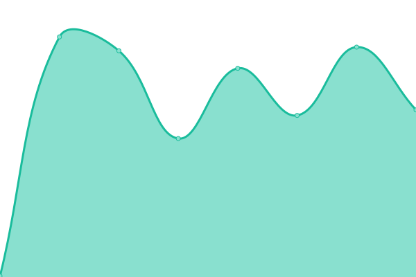

# [📈 Live Status](https://larskristianhaga.github.io/uptime-monitor): <!--live status--> **🟩 All systems operational**

This repository contains the open-source uptime monitor and status page for [Lars Kristian Haga](https://www.linkedin.com/in/larskhaga/), powered by [Upptime](https://github.com/upptime/upptime).

With [Upptime](https://upptime.js.org), you can get your own unlimited and free uptime monitor and status page, powered entirely by a GitHub repository. We use [Issues](https://github.com/larskristianhaga/uptime-monitor/issues) as incident reports, [Actions](https://github.com/larskristianhaga/uptime-monitor/actions) as uptime monitors, and [Pages](https://larskristianhaga.github.io/uptime-monitor) for the status page.

<!--start: status pages-->
<!-- This summary is generated by Upptime (https://github.com/upptime/upptime) -->
<!-- Do not edit this manually, your changes will be overwritten -->
<!-- prettier-ignore -->
| URL | Status | History | Response Time | Uptime |
| --- | ------ | ------- | ------------- | ------ |
|  [3fs.no](https://3fs.no) | 🟩 Up | [3fs-no.yml](https://github.com/larskristianhaga/uptime-monitor/commits/HEAD/history/3fs-no.yml) | 

 1229ms
     
 | 

<a href="https://larskristianhaga.github.io/uptime-monitor/history/3fs-no">100.00%</a>
    

|  [paal-erik.no](http://paal-erik.no) | 🟩 Up | [paal-erik-no.yml](https://github.com/larskristianhaga/uptime-monitor/commits/HEAD/history/paal-erik-no.yml) | 

 646ms
     
 | 

<a href="https://larskristianhaga.github.io/uptime-monitor/history/paal-erik-no">100.00%</a>
    

|  [trefellingspesialisten.no](http://trefellingspesialisten.no) | 🟩 Up | [trefellingspesialisten-no.yml](https://github.com/larskristianhaga/uptime-monitor/commits/HEAD/history/trefellingspesialisten-no.yml) | 

 504ms
     
 | 

<a href="https://larskristianhaga.github.io/uptime-monitor/history/trefellingspesialisten-no">100.00%</a>
    

|  [trefellings-spesialisten.no](http://trefellings-spesialisten.no) | 🟩 Up | [trefellings-spesialisten-no.yml](https://github.com/larskristianhaga/uptime-monitor/commits/HEAD/history/trefellings-spesialisten-no.yml) | 

 541ms
     
 | 

<a href="https://larskristianhaga.github.io/uptime-monitor/history/trefellings-spesialisten-no">100.00%</a>
    

|  [casahaga.no](https://casahaga.no) | 🟩 Up | [casahaga-no.yml](https://github.com/larskristianhaga/uptime-monitor/commits/HEAD/history/casahaga-no.yml) | 

 321ms
     
 | 

<a href="https://larskristianhaga.github.io/uptime-monitor/history/casahaga-no">100.00%</a>
    

|  [laline.no](https://laline.no) | 🟩 Up | [laline-no.yml](https://github.com/larskristianhaga/uptime-monitor/commits/HEAD/history/laline-no.yml) | 

 306ms
     
 | 

<a href="https://larskristianhaga.github.io/uptime-monitor/history/laline-no">100.00%</a>
    

|  [nginx-response-test](https://nginx-response-test.fly.dev) | 🟩 Up | [nginx-response-test.yml](https://github.com/larskristianhaga/uptime-monitor/commits/HEAD/history/nginx-response-test.yml) | 

 670ms
     
 | 

<a href="https://larskristianhaga.github.io/uptime-monitor/history/nginx-response-test">100.00%</a>
    

|  [go-response-test](https://go-response-test.fly.dev) | 🟩 Up | [go-response-test.yml](https://github.com/larskristianhaga/uptime-monitor/commits/HEAD/history/go-response-test.yml) | 

 470ms
     
 | 

<a href="https://larskristianhaga.github.io/uptime-monitor/history/go-response-test">100.00%</a>
    

|  [java-response-test](https://java-response-test.fly.dev) | 🟩 Up | [java-response-test.yml](https://github.com/larskristianhaga/uptime-monitor/commits/HEAD/history/java-response-test.yml) | 

 3601ms
     
 | 

<a href="https://larskristianhaga.github.io/uptime-monitor/history/java-response-test">100.00%</a>
    

<!--end: status pages-->

[**Visit our status website →**](https://larskristianhaga.github.io/uptime-monitor)

## 📄 License

- Powered by: [Upptime](https://github.com/upptime/upptime)
- Code: [MIT](./LICENSE) © [Anand Chowdhary](https://anandchowdhary.com), supported by [Pabio](https://pabio.com)
- Data in the `./history` directory: [Open Database License](https://opendatacommons.org/licenses/odbl/1-0/)
